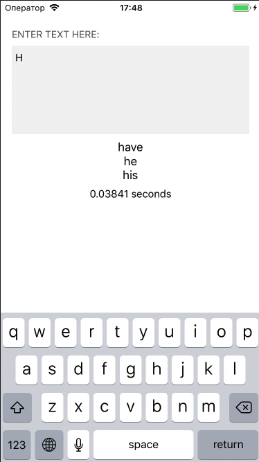

# About

This project includes a simple implementation of word prediction algorithm using n-gram probabilistic model. Inspired by [Autocomplete](https://github.com/mharb75/Autocomplete) (implementation using R programming language).

You can take this idea as a starting point and extend it for your needs.

